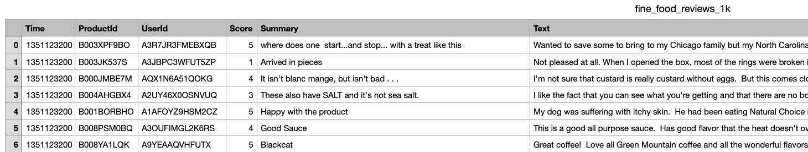

# Text embedding example
- An embedding is a vector (list) of floating point numbers. 

## How to use
- You should have a openai's API key.
- You can get it from [here](https://platform.openai.com/account/billing/overview)
- Conda is required.

### Set the virtual environment
```bash
$ make env
$ conda activate 00-openai-text-embedding
$ make setup
```

### Dataset
- `fine_food_reviews_1k.csv`.


### Run the example
- Get the embedding information about `fine_food_reviews_1k.csv`.
- It will take about 5 minutes.
```bash
$ export OPENAI_API_KEY=<YOUR API KEY>
$ python embedding.py
```
- Visualize embedding vectors
    - We will use t-SNE to reduce the dimensionality of the embeddings from 1536 to 2.
```bash
$ python visualize_2d.py
$ ls 
tsne_2d.png
```

## Embedding API Guide
- https://platform.openai.com/docs/api-reference/embeddings

### Supported model
- OpenAI offers one second-generation embedding model (denoted by -002 in the model ID) and 16 first-generation models (denoted by -001 in the model ID).
- Recommend using text-embedding-ada-002
- You can check all the model served by openai in `model_list.json`
```
$ python embedding.py
$ ls
model_list.json
```

### Embedding api Response 
```
{
  "object": "list",
  "data": [
    {
      "object": "embedding",
      "embedding": [
        0.0023064255,
        -0.009327292,
        .... (1536 floats total for ada-002)
        -0.0028842222,
      ],
      "index": 0
    }
  ],
  "model": "text-embedding-ada-002",
  "usage": {
    "prompt_tokens": 8,
    "total_tokens": 8
  }
}
```

## Reference
- https://github.com/openai/openai-cookbook/blob/main/examples/Obtain_dataset.ipynb